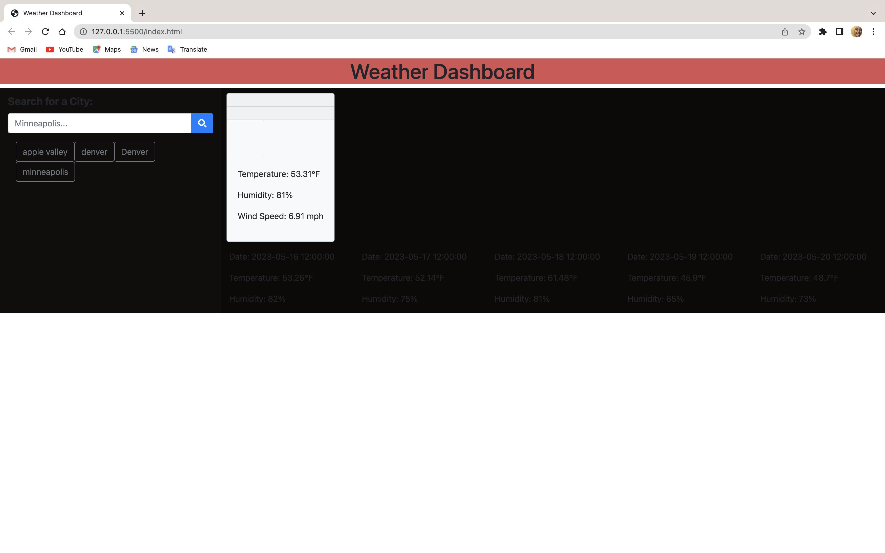

# 06-Server-Side-APIs-Weather-Dashboard

A Weather Dashboard

This project aims to create a weather dashboard that fetches and displays weather data from a third-party API - the OpenWeather API. The dashboard will display both the current and the future weather conditions of various cities, aiding travelers in their trip planning. The user can search for a city and be presented with the current weather conditions, including the city name, the date, an icon representing the weather, the temperature, the humidity, and the wind speed. The dashboard will also provide a 5-day forecast showing similar information. The searched cities will be added to a search history, and users can click on a city in the history to view its current and future conditions again.
To use the dashboard type the name of a city in the search box and select the spyglass. As you search the city will be saved to a list allowing you to select them again for viewing.   

## Installation
1. Clone this repository to your local machine using git clone <repository-url>.
2. Navigate to the cloned repository on your local machine using your command line software.
3. Open the HTML file in your preferred browser to view the website.

## Usage

1. To start using the Weather Dashboard, simply open the website in your brows
2. You'll see a search bar or form input on the dashboard. Type the name of the city you want to get the weather information for and press Enter or click the Search button.
3. The dashboard will display the current weather conditions for the searched city, including the city name, the date, an icon representing the weather, the temperature, the humidity, and the wind speed.
4. Below the current weather conditions, you'll find a 5-day forecast for the city. This forecast will show the date, an icon representing the weather, the temperature, the wind speed, and the humidity.
5. The searched city will be added to your search history. You can click on any city in the search history to view its current and future conditions again.

Below is a screen shot of the weather dashboard:

